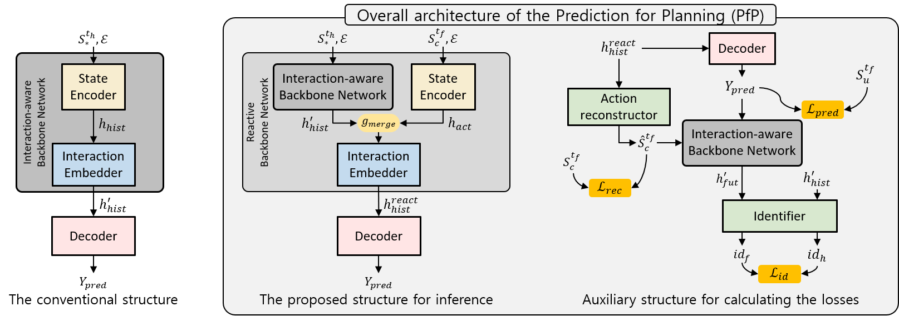
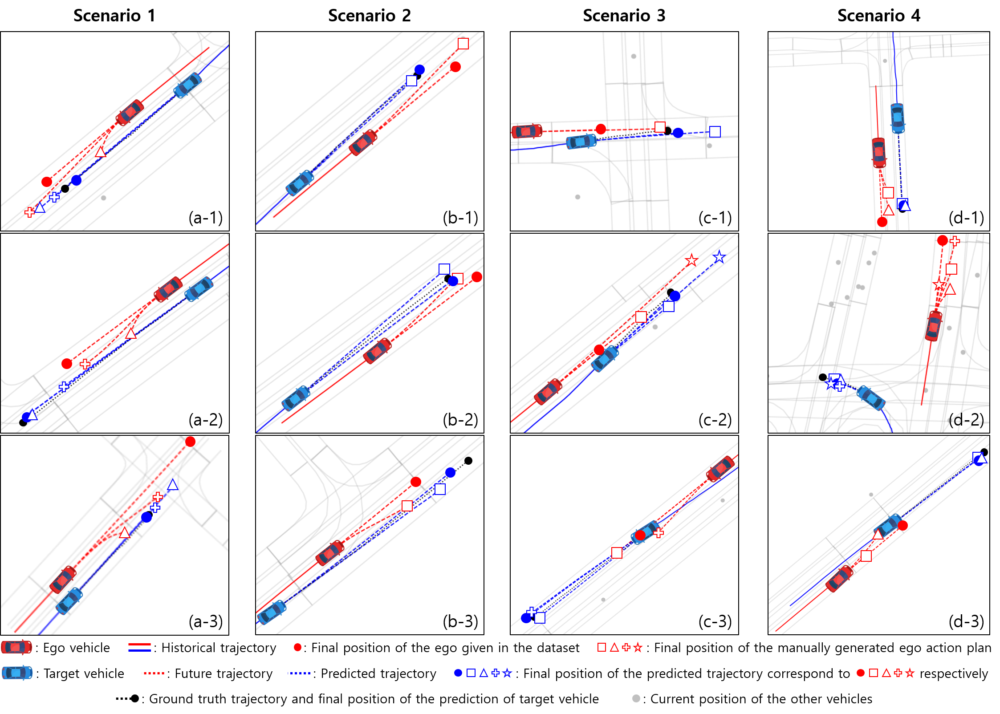

# Prediction for Planning (PfP): Semi-supervised Learning for Reactive Prediction conditioned by Future Plan and Its Application to Autonomous Driving

"Anonymous"

Affiliation



[Acknowledgment]
Great thanks for remarking trajectory prediction work by [Liang et al](https://github.com/uber-research/LaneGCN). Our work is generally applicable wrapping framework but this repository is about predicting the future trajectory of the surrounding vehicles in the field of autonomous driving using LaneGCN as basis network

Table of Contents
=================
  * [Install](#install)
  * [Prepare Data](#Prepare-Data)
  * [Training](#Training)
  * [Testing](#testing)
  * [Licence](#licence)
  * [Citation](#citation)


## Install
You need to install following git repositories:
- [LaneGCN](https://github.com/uber-research/LaneGCN#install-dependancy)
- [Argoverse API](https://github.com/argoai/argoverse-api#installation)

* note: Since the original Argoverse API is modified in this works, please you the argoverse-api included in this repository

## Prepare Data
In this repository, small amount of the raw data and corresponding post-processed sample of Argoverse Motion Forecasting dataset is included.
If you want to use full data, please download from [Argoverse](https://www.argoverse.org/tasks.html#forecasting-link) official website

Since the PfP requires future trajectory of the ego vehicle, the test set is not used.

[Confidential] Because of the internal issue, the source code for data processing is blocked.
For academical use, please contact "Anonymous"

## Training
### Training with single GPU
```sh
python train.py
```

### Training with multigpus using horovod
```sh
# single node with 4 gpus
horovodrun -np 4 -H localhost:4 python train.py
```

## Testing




